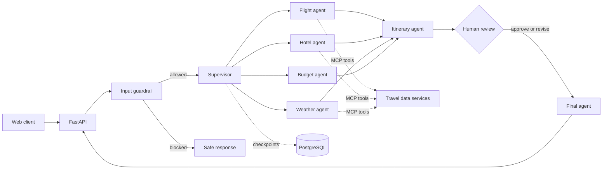

# AtlasFlow AI

AtlasFlow AI is a production-minded multi-agent travel planner built with LangGraph, Model Context Protocol (MCP), FastAPI, PostgreSQL, and Groq. A supervisor selects only the specialists needed for each request, an input guardrail filters out-of-scope prompts, and a human approval checkpoint keeps users in control before finalization.

## Why this project matters

- Dynamic supervisor routing across flight, hotel, weather, budget, and itinerary agents
- Live data adapters exposed through remote and local MCP servers
- Durable LangGraph checkpoints in PostgreSQL
- Human-in-the-loop approval and feedback before the final response
- Non-blocking FastAPI boundary for synchronous graph execution
- Validated request and thread identifiers, sanitized production errors, and readiness probes
- Automated API tests, CI quality gates, and a non-root Docker runtime

## Architecture



More detail is available in [docs/architecture.md](docs/architecture.md).

## Stack

Python 3.11 · FastAPI · LangGraph · LangChain · Groq · MCP · PostgreSQL · Tavily · AviationStack · OpenWeather · Docker

## Local setup

1. Create a virtual environment and install dependencies.

   ```bash
   python3 -m venv .venv
   source .venv/bin/activate
   pip install -r requirements.txt -r requirements-dev.txt
   ```

2. Copy the environment template and add your credentials.

   ```bash
   cp .env.example .env
   ```

3. Start the API.

   ```bash
   uvicorn app:app --reload
   ```

4. Open <http://127.0.0.1:8000>. API documentation is available at <http://127.0.0.1:8000/docs>.

The liveness endpoint is `GET /health`; `GET /ready` returns `503` until the core Groq and PostgreSQL settings are present.

## Tests and quality checks

```bash
pytest -q
ruff check .
python3 -m compileall -q app.py backend.py mcp_client.py custom_weather_mcp_server.py
```

## Docker

```bash
docker build -t atlasflow-ai .
docker run --env-file .env -p 8000:8000 atlasflow-ai
```

## API

| Method | Endpoint | Purpose |
|---|---|---|
| `POST` | `/api/travel` | Start or continue a planning thread |
| `POST` | `/api/travel/approve` | Approve a draft or request a revision |
| `GET` | `/health` | Lightweight liveness check |
| `GET` | `/ready` | Core configuration readiness check |

## Engineering ownership

AtlasFlow AI is maintained by **Mohamed Aziz Aydi**. This version adds a new project identity, asynchronous API isolation for the synchronous graph, lazy agent startup, strict boundary validation, safe error references, liveness/readiness separation, API tests, continuous integration, container hardening, and updated architecture documentation.

The initial travel-planner foundation was adapted from the Apache-2.0 project by `entbappy`; see [NOTICE](NOTICE). Subsequent modifications are documented through this repository's commit history.

## License

Licensed under Apache License 2.0. See [LICENSE](LICENSE) and [NOTICE](NOTICE).
